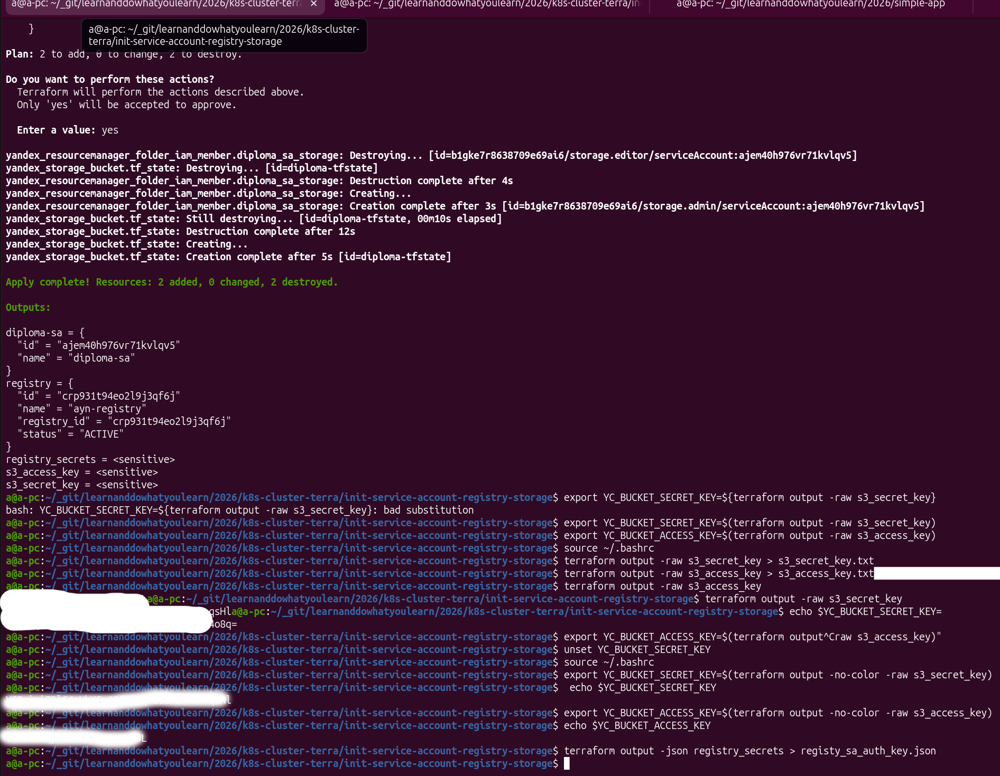
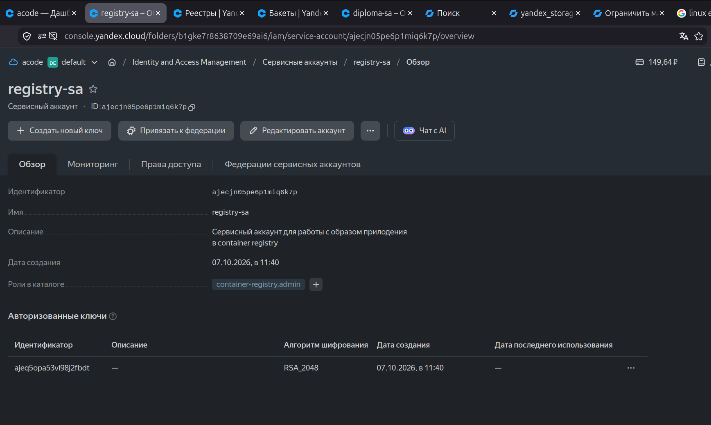
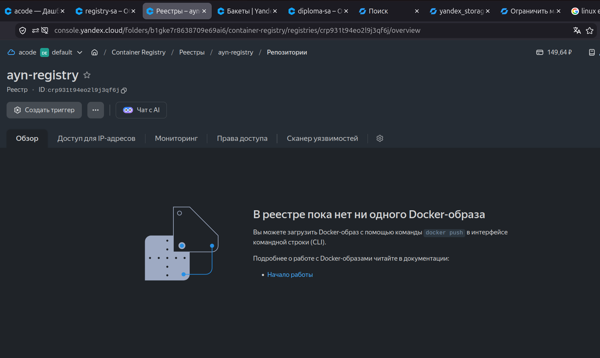
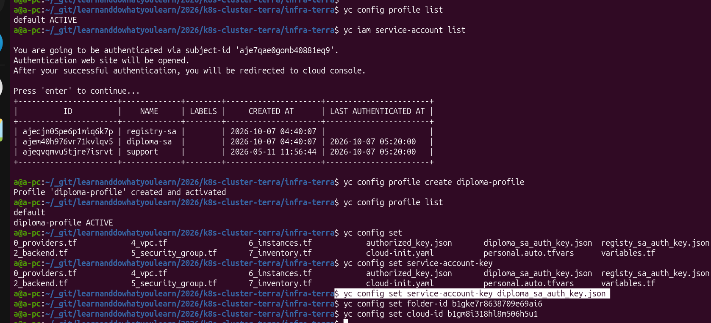
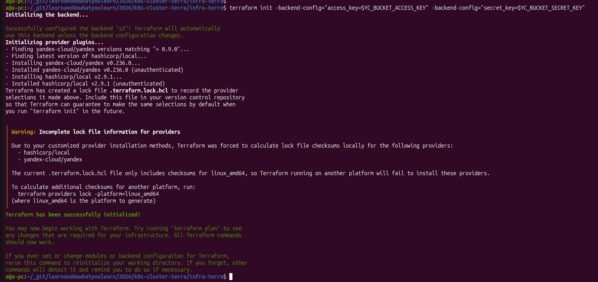

# Диплом Айнур Шауэрман в профессии DEVOPS

## 1. Создание облачной инфраструктуры

### 1.1. Создание первичных необходимых сущностей

Создание этих первичных сущностей находит в папке [init-service-account-registry-storage/](./init-service-account-registry-storage/)

Создаются:

1) Сервисные аккаунты для 

  * [diploma-sa](./init-service-account-registry-storage/1_service-account.tf#L2) с правами, котрые понадобятся в дальнейшем для обслуживания инфрастуктуры
    
    с ключами для работы с backend S3 bucket:
      * [static-key](./init-service-account-registry-storage/1_service-account.tf#L30)
      * [diploma_sa_key](./init-service-account-registry-storage/1_service-account.tf#L55)


  * [registry_sa](./init-service-account-registry-storage/3_container-registry.tf#L6)
    c правами пушить изображения с поомщью ci/cd в container registry YC  и затем пулить докер изображения в Кубере:

      * [container-registry.admin](./init-service-account-registry-storage/3_container-registry.tf#L13)
    
    с ключами для автоматического деплоя:
      * [registry_sa_key](./init-service-account-registry-storage/3_container-registry.tf#L19)
      

Запустила `terraform apply`:



Тут необходимо скопировать созданные секреты. Сделала командами (с некоторыми запинками, что обычно думаю не только для меня):

```shell
$ terraform output -json registry_secrets > registy_sa_auth_key.json
$ export YC_BUCKET_SECRET_KEY=$(terraform output -no-color -raw s3_secret_key)
$ export YC_BUCKET_ACCESS_KEY=$(terraform output -no-color -raw s3_access_key)
$ source ~/.bashrc
```

Затем добавляю создание `auth_key.json` для сервисного акааунта `diploma-sa`, ведь это нужно для создания виртуальных машин.


Этот ключ скопирую в папку с проектом создания виртуальных машин для Кубернетис кластера.

Смотрю результаты.

* Аккаунты для работы:




* Реестр (пока пустой):




* Хранилище (пока пустой):


### 1.2. Создание инфрастукртуры для мастер и воркер нод Кубернетиса


```
[localhost] ──kubectl──► [Мастер API: публичный IP :443/:6443]
                              │
                              ▼ (внутренняя сеть VPC)
                        [Воркер-1] [Воркер-2] [Воркер-3]
                              │
                              └──► интернет (тянуть образы)
```

Создаю профиль, который соотвествует сервисному аккунту `diploma-sa`[1]



Инфраструктра создаётся через терраформ, описанный в [infra-terra/](./infra-terra/)

```shell
$ cd infra-terra
$ terraform init \
  -backend-config="access_key=$YC_BUCKET_ACCESS_KEY" \
  -backend-config="secret_key=$YC_BUCKET_SECRET_KEY"
```




## 2. Создание Kubernetes кластера

В отличие от Yandex Managed Kubernetes, здесь нет автоматической подстановки IAM-токена в поды — её нужно делать вручную через imagePullSecrets.

## 3. Создание тестового приложения


Скопировала полученные данные в `github_actions_secrets.json` и ID container registry в репозиторий приложения:


* [https://github.com/aykuli/simple-app](https://github.com/aykuli/simple-app)

    * Для доступа к хранилищу Яндекса используется [yc-actions/yc-cr-login](https://github.com/yc-actions/yc-cr-login#usage)


3) Создала приложение и экшн к нему [deploy.yml](https://github.com/aykuli/simple-app/blob/master/.github/workflows/deploy.yml)

4) Задеплоила в `container registry YC`


5) Результат создания Хранилища и Сохраения в Хранилище Образ приложения ниже:


## Список литературы

1. [Создание профиля сервисного аккаунта](https://yandex.cloud/ru/docs/tutorials/infrastructure-management/terraform-state-storage#create-service-account)

