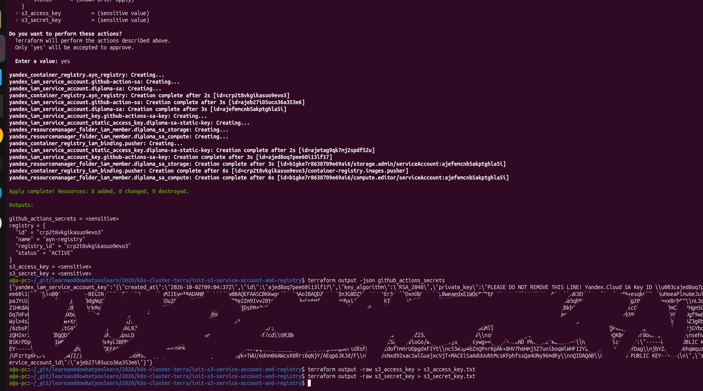
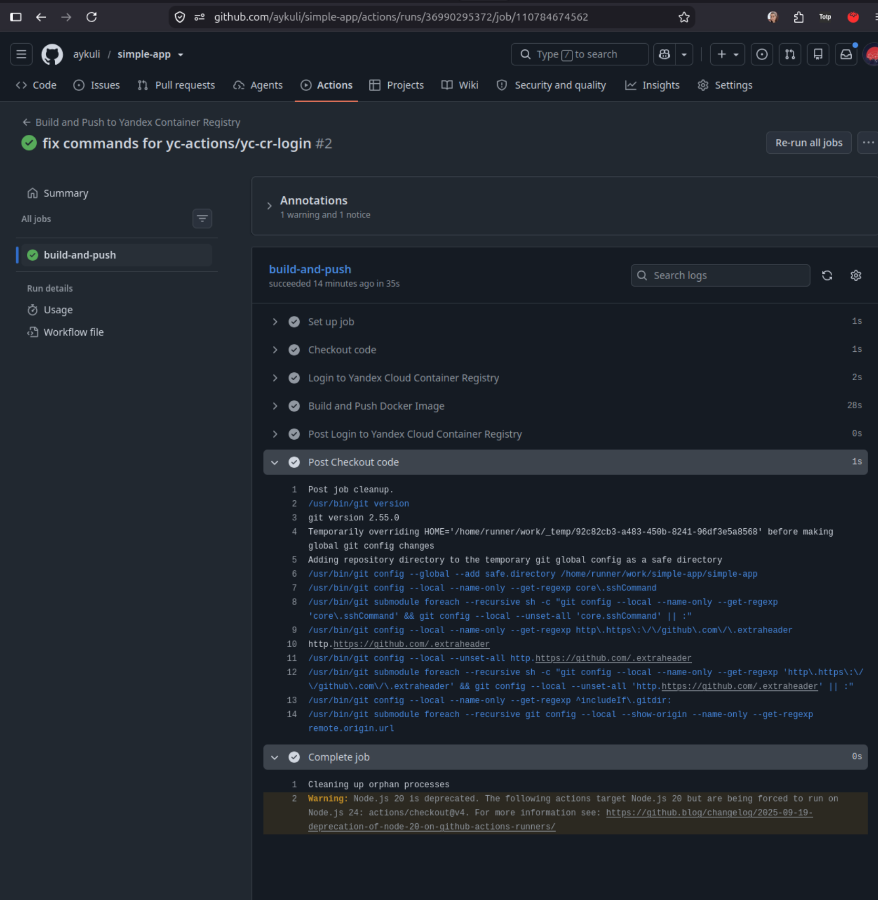
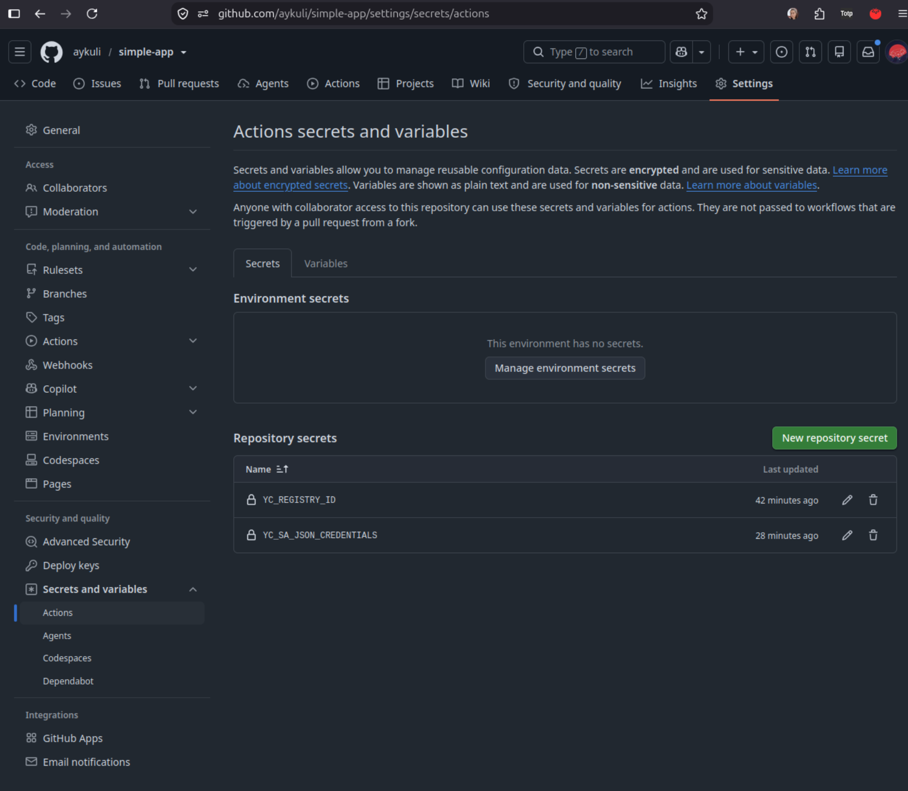
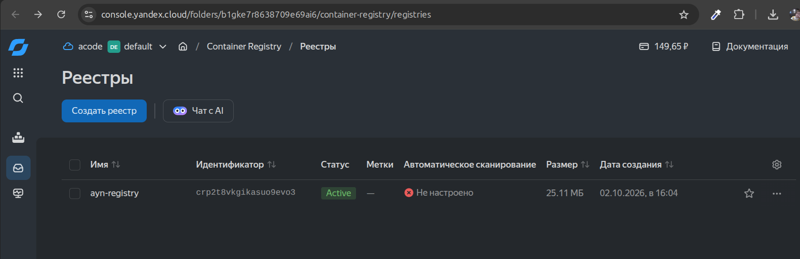
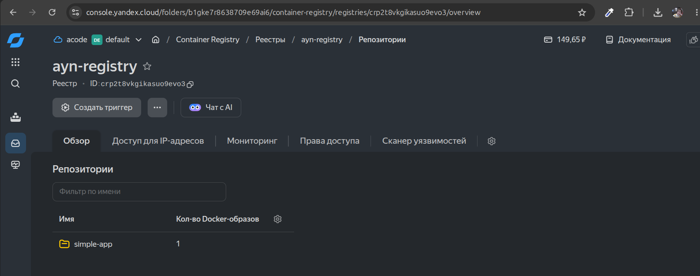
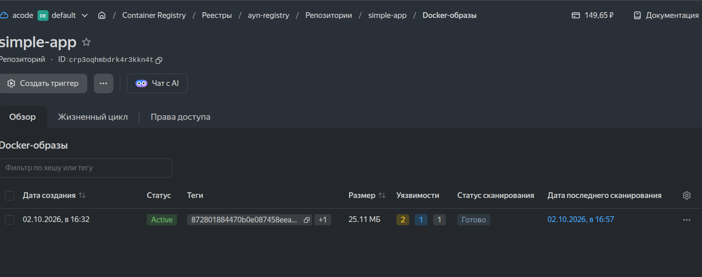
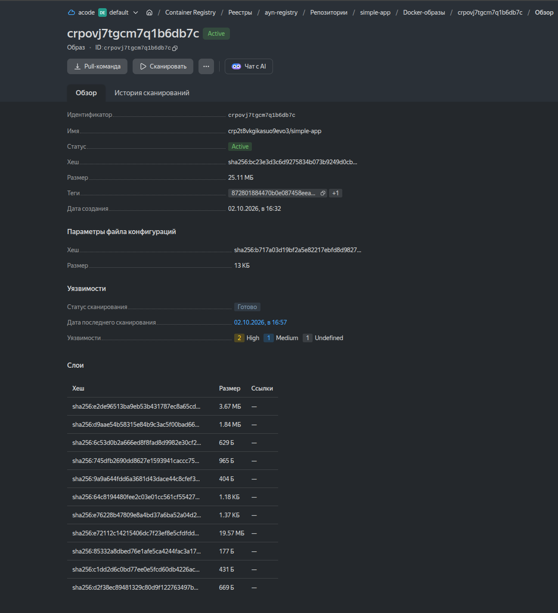

# Диплом Айнур Шауэрман в профессии DEVOPS

Шаги работы:
## 1. Создание первичных необходимых сущностей

1) Собраны в папке [init-s3-service-account-and-registry](./init-s3-service-account-and-registry/)

1) Сервисные аккаунты

  * [diploma-sa](./init-s3-service-account-and-registry/1_service-account.tf#L2)
    с правами, котрые понадобятся в дальнейшем:
      * [`storage.admin`](./init-s3-service-account-and-registry/1_service-account.tf#L10)
      * [`compute.admin`](./init-s3-service-account-and-registry/1_service-account.tf#L17)
    
    с ключами для работы с backend S3 bucket:
      * [static-key](./init-s3-service-account-and-registry/1_service-account.tf#L23)
      * эти ключи я создавала для s3, так как для создания `s3` необхоlимы эти ключи

  * [github-action-sa](./init-s3-service-account-and-registry/3_container-registry.tf#L6)
    c правами пушить изоражения с `github actions` и затем пользоваться в Кубере:

      * [container-registry.admin](./init-s3-service-account-and-registry/3_container-registry.tf#L13)
    с ключами, котрые я скопировала в `github action secrets` для автоматического деплоя:
      * [service_account_key](./init-s3-service-account-and-registry/3_container-registry.tf#L19)
      *

Запустила `terraform apply`:

Скопировала полученные данные в репозиторий приложения:

* [https://github.com/aykuli/simple-app](https://github.com/aykuli/simple-app)

    * Для доступа к хранилищу Яндекса используется [yc-actions/yc-cr-login](https://github.com/yc-actions/yc-cr-login#usage)

3) Создала приложение и экшн к нему

4) Задеплоила в `container registry YC`

5) Результат создания Хранилища и Сохраения в Хранилище Образ приложения ниже:

